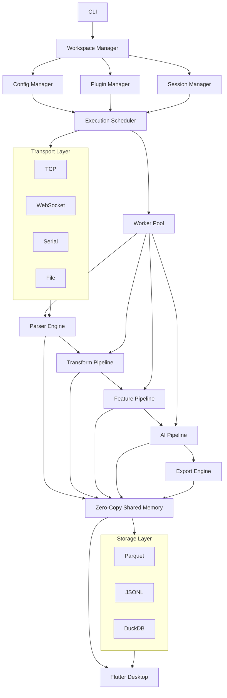

# Telemetor

Real-time telemetry visualizer: a Flutter dashboard streaming live data from a
Python test backend over a TCP+ACK protocol (see `Backend/ACK.md`).

The dashboard auto-discovers channels from the stream's header packet, charts
them live (sliding window, LTTB decimation, ≤30 fps repaints), and lets you
add/remove/fullscreen chart tiles at runtime. Material 3 light/dark theme.

## Overall architecture




This is the bird's-eye orchestration view. The backend coordinates the core
pipeline, and Flutter sits at the edge as the visualization client.

## Architecture direction

Telemetor is being shaped as a backend-owned system. Flutter is the client layer;
the backend owns transport, parsing, execution, storage, and orchestration.

### Layer 1

Transport

```text
TCP

UDP

Serial

USB

WebSocket

Files

Memory Mapping
```

You learn networking.

### Layer 2

Parser Engine

Every parser becomes a plugin.

```text
CSV

JSON

CAN Bus

Telemetry

ROS

MAVLink

Custom Binary
```

Now you have plugin architecture.

### Layer 3

Execution Engine

This is where most of the system intelligence lives.

```text
Node Graph

↓

Scheduler

↓

Dependency Resolver

↓

Worker Pool

↓

Execution
```

Every parser becomes a DAG.

Exactly like Airflow, Ray, Dask, and PyTorch.

### Layer 4

Worker Pool

This is where Rust becomes useful.

Instead of:

```text
for row in csv:
```

Create:

```text
Producer

↓

Bounded Queue

↓

N Workers

↓

Aggregator

↓

Cache

↓

UI
```

Now you are learning concurrency.

### Layer 5

Memory

Do not pass copies.

Study Apache Arrow, Polars, PyTorch storage, shared memory, zero-copy,
memory mapping, and SIMD parsing.

This alone teaches computer architecture.

### Layer 6

Scheduling

Instead of:

```text
parse
plot
done
```

Create:

```text
Scheduler

↓

Priority Queue

↓

Ready Queue

↓

Worker Assignment

↓

Backpressure

↓

Cancellation

↓

Retries
```

Now you are literally implementing OS concepts.

### Layer 7

Storage

Instead of:

```text
JSONL
```

Think:

```text
Storage Interface

↓

DuckDB

↓

Parquet

↓

CSV

↓

SQLite
```

Plugin again.

### Layer 8

Visualization

Flutter becomes a client.

Nothing more.

Backend owns everything.

## Requirements

- Flutter (stable channel) with Linux desktop support
- Python 3.11+

## Run it

Backend (terminal 1):

```bash
cd Backend
python -m venv .venv && .venv/bin/pip install -r requirements.txt
.venv/bin/python serverImp.py
```

App (terminal 2):

```bash
flutter pub get
flutter run -d linux
```

The app connects to `127.0.0.1:12345` by default; change host/port at runtime
via the settings (gear) icon. The status bar at the bottom shows connection
state, rows/s, total rows and dropped frames.

## Tests

```bash
flutter analyze
flutter test            # unset http_proxy/https_proxy if a local proxy runs
.venv/bin/python -m pytest Backend/
```

## Project layout

- `lib/src/models/` – `TelemetryChannel`, `TelemetrySample`
- `lib/src/network/` – transport interface, TCP+ACK implementation, wire parser
- `lib/src/data/` – `TelemetryHub` (per-channel broadcast streams), dashboard
  state, stream statistics, ring buffer
- `lib/src/charts/` – reusable `TelemetryChart` (fl_chart + LTTB)
- `lib/src/screens/` – dashboard, dialogs
- `Backend/` – Python socket server, CSV-to-JSON parser, sample flight data
  (`rocket.csv`)

Roadmap and milestone log: see `GOALS.md`.
